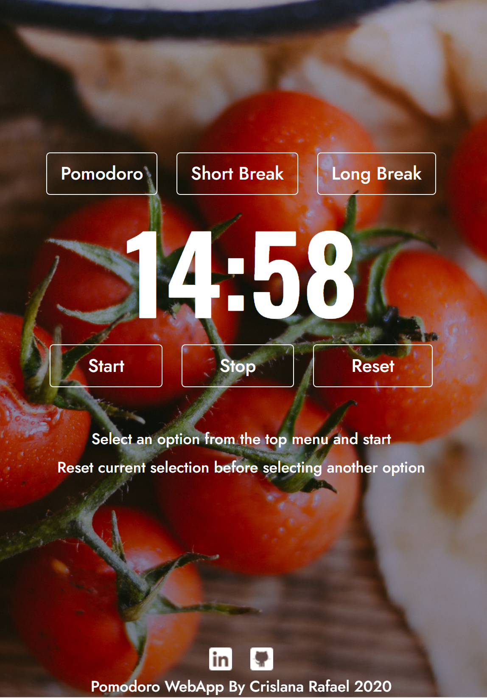

# Welcome to TomaterClock :tomato::tomato:
TomaterClock is a simple online pomodoro timer I created with Javascript. I wanted to explore some event-driven programming I learned in my web programming class and created this as a result. And also, I've heard great things about the Pomodoro Method for increasing my productivity!

[Learn more about the Pomodoro Technique](https://todoist.com/productivity-methods/pomodoro-technique)

# How to Use TomaterClock

 

As the moment I designed TomaterClock's preset times as follows:

- The Pomodoro button is used to time your work/productivity session.
- The Short Break button is used to time a short 5 minute break. You can use this to decompress your brain by doing things like watching [Sea Otter videos](https://www.youtube.com/watch?v=50qgLozAtSQ) 
- The Long Break button is used to time a 15 minute break after more than one Pomodoro session
- Available to use online/mobile      

**Here's how to start:**
1. Select the Pomodoro Button
2. Click the Start Button
3. If you need to pause the timer press the Stop button. To unpause, press the Start button.
4. Once the timer reaches zero, there will be a bell ringing to alert you. You can then press the Reset button to reset the timer

# Try It Out
[TomaterClock](https://inspiring-jackson-81176d.netlify.app/)

